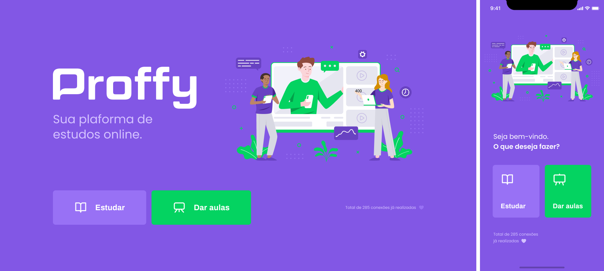

<div align="center">
  <a href="https://www.typescriptlang.org/">
    
  </a>
  <a href="https://nodejs.org/">
    
  </a>
  <a href="https://reactjs.org/">
    
  </a>
  <a href="https://reactnative.dev/">
    
  </a>
  <a href="https://github.com/amandabezerra/proffy/blob/master/LICENSE">
    
  </a>
</div>

<br/>

<div align="center">
  <div>
    <a href="#tecnologias">Tecnologias</a>
    &nbsp;&nbsp;&nbsp;|&nbsp;&nbsp;&nbsp;
    <a href="#uso"> Instalação e Uso</a>
    &nbsp;&nbsp;&nbsp;|&nbsp;&nbsp;&nbsp;
    <a href="#layout">Layout</a>
    &nbsp;&nbsp;&nbsp;|&nbsp;&nbsp;&nbsp;
    <a href="#creditos">Créditos</a>
  </div>
  <br/>
  <div>
    
  </div>
</div>


<h2 id="tecnologias">:computer: &nbsp; Tecnologias</h2>

<h3>Server</h3>

+ [Node.js](https://nodejs.org/)
+ [Express](https://expressjs.com/)
+ [Knex](http://knexjs.org/)
+ [Sqlite](https://www.sqlite.org/index.html)

<h3>Web</h3>

+ [React](https://reactjs.org/)
+ [React Router](https://reactrouter.com/)
+ [Axios](https://github.com/axios/axios)

<h3>Mobile</h3>

+ [React Native](https://reactnative.dev/)
+ [Expo](https://expo.io)
+ [Axios](https://github.com/axios/axios)


<h2 id="uso">:keyboard: &nbsp; Instalação e Uso</h2>

+ Instale o [Node](https://nodejs.org/en/download/)
+ Opcionalmente [instale o Yarn](https://classic.yarnpkg.com/en/docs/install), mas fique a vontade para utilizar apenas o npm, basta substituir `yarn` por `npm` ao rodar os comandos abaixo.
+ Clone o repositório:
```
git clone https://github.com/amandabezerra/proffy.git
```

<h3>Server</h3>

+ Acesse a pasta /server

```
$ cd server
```

+ Instale as dependências:
```
$ yarn install
```

+ Realize as migrações do banco de dados:

```
$ yarn run knex:migrate
```

+ Inicie a aplicação:
```
$ yarn start
```

+ A aplicação estará disponível em http://localhost:3333


<h3>Web</h3>

+ Acesse a pasta /web
```
$ cd web
```

+ Instale as dependências:
```
$ yarn install
```

+ Inicie a aplicação:
```
$ yarn start
```

+ Acesse a aplicação em http://localhost:3000


<h3>Mobile</h3>

+ Acesse a pasta /mobile

```
$ cd mobile
```

+ Instale as dependências:
```
$ yarn install
```

+ Em [config](./mobile/src/config/index.ts) preencha *API_ADDRESS* com seu endereço IP para que o `mobile` possa fazer requisições no endereço em que o `server` está rodando. Por exemplo: `API_ADDRESS = '192.168.1.102'`.

+ Inicie a aplicação:
```
$ yarn start
```

+ Acesse http://localhost:19002/ para visualizar o QR code

+ Abra o app [Expo](https://play.google.com/store/apps/details?id=host.exp.exponent) no seu Android ou o app Camera no iOS e scaneie o QR code para ter acesso a aplicação

Para mais informações sobre Expo e formas alternativas de rodar o mobile, acesse [Expo Development Tools](https://expo.io/tools#client).

<h2 id="layout">:art: &nbsp; Layout</h2>

Acesse os protótipos no Figma:
+ [Web](https://www.figma.com/file/GHGS126t7WYjnPZdRKChJF/Proffy-Web)
+ [Mobile](https://www.figma.com/file/e33KvgUpFdunXxJjHnK7CG/Proffy-Mobile)


<h2 id="creditos">:link:  &nbsp; Créditos</h2>

Este projeto foi produzido a partir das aulas e materiais da Next Level Week 2 da [Rocketseat](https://rocketseat.com.br/) :rocket:
